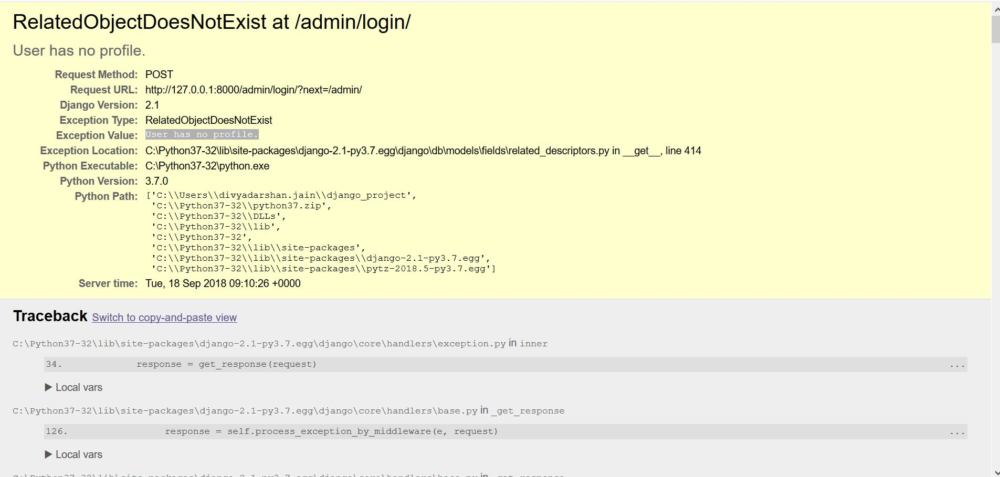

source .env/bin/activate

chmod +x ./bin/file_name

<!-- checklist of settings -->
python3 manage.py check --deploy


<!-- to get new app(folder) install -->
python3 manage.py startapp app_name


<!-- Run the development web server  -->
python3 manage.py runserver
<!--  -->
# auto activate virtualenv
function cd() {
  builtin cd "$@"

  if [[ ! -z "$VIRTUAL_ENV" ]] ; then
    # If the current directory is not contained
    # within the venv parent directory -> deactivate the venv.
    cur_dir=$(pwd -P)
    venv_dir="$(dirname "$VIRTUAL_ENV")"
    if [[ "$cur_dir"/ != "$venv_dir"/* ]] ; then
      deactivate
    fi
  fi

  if [[ -z "$VIRTUAL_ENV" ]] ; then
    # If config file is found -> activate the vitual environment
    venv_cfg_filepath=$(find . -maxdepth 2 -type f -name 'pyvenv.cfg' 2> /dev/null)
    if [[ -z "$venv_cfg_filepath" ]]; then
      return # no config file found
    fi

    venv_filepath=$(cut -d '/' -f -2 <<< ${venv_cfg_filepath})
    if [[ -d "$venv_filepath" ]] ; then
      source "${venv_filepath}"/bin/activate
    fi
  fi
}

<!--  -->

Note:
## Admin User has no profile
in case login to admin site and got the error (User has no profile) 
[stackoverflow](https://stackoverflow.com/questions/52385596/relatedobjectdoesnotexist-at-admin-login-user-has-no-profile)

-Enter a python terminal in your virtual environment

```python3 manage.py shell```

-Run this, will fix your issue without blowing out the database
```
from django.contrib.auth.models import User
from users.models import Profile
user = User.objects.get(username='enter_admin_user_here')
profile = Profile(user=user)
profile.save()
```

This will add a user profile for the admin user.

This command will copy the django-ckeditor static and media resources into the directory given by the STATIC_ROOT.

`python3 manage.py collectstatic`